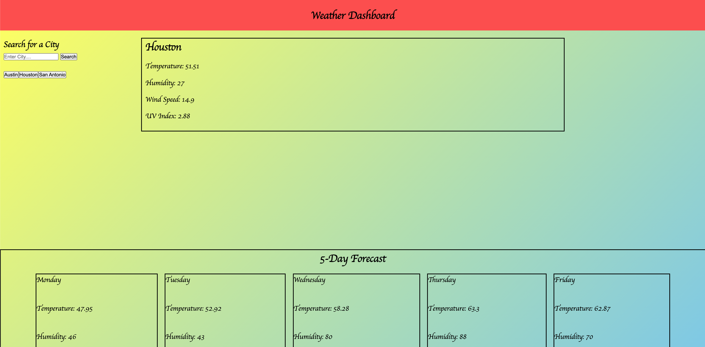

# weather_dash

​
## Description
​
Look up the weather in any city. Get the uv index and the 5 day forecast for the week. Type in the 
city you want and click the search button.

Deploy app: https://mariohernandezk10.github.io/weather_dash/

Screenshot:

​
## Table of Contents 
​
* [Installation](#installation)
​
* [Usage](#usage)
​
* [License](#license)
​
* [Contributing](#contributing)
​
* [Tests](#tests)
​
* [Questions](#questions)
​
## Installation
​
To install necessary dependencies, run the following command:
​
```
npm i
```
​
## Usage
​
Free to use; have fun :)
​
## License
​
This project is licensed under the APACHE 2.0 license.
  
## Contributing
​
API website: https://openweathermap.org/api
​
## Questions
​
If you have any questions about the repo, open an issue or contact me directly at mariohernandezk10@gmail.com. You can find more of my work at [MarioHernandez](https://github.com/mariohernandezk10/weather_dash).
